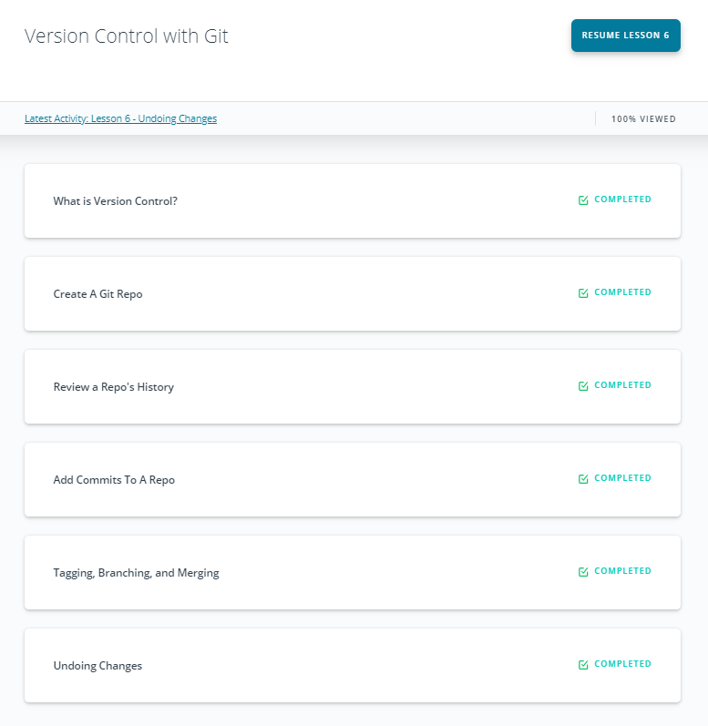
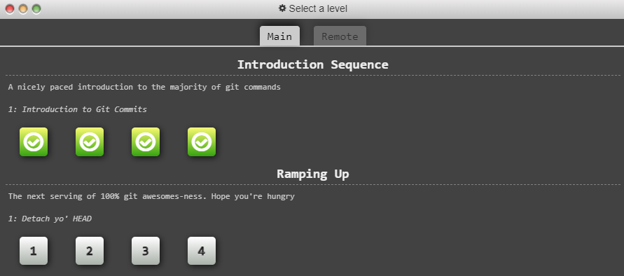
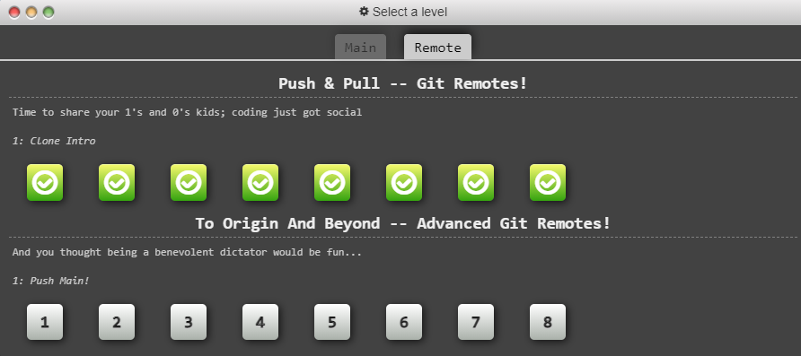
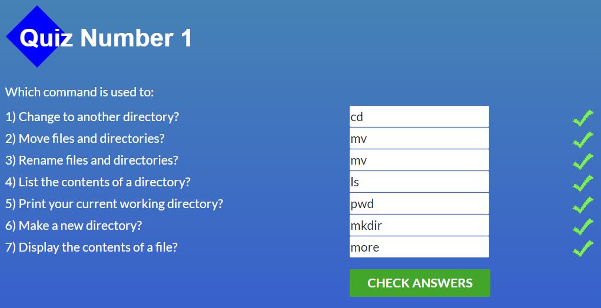
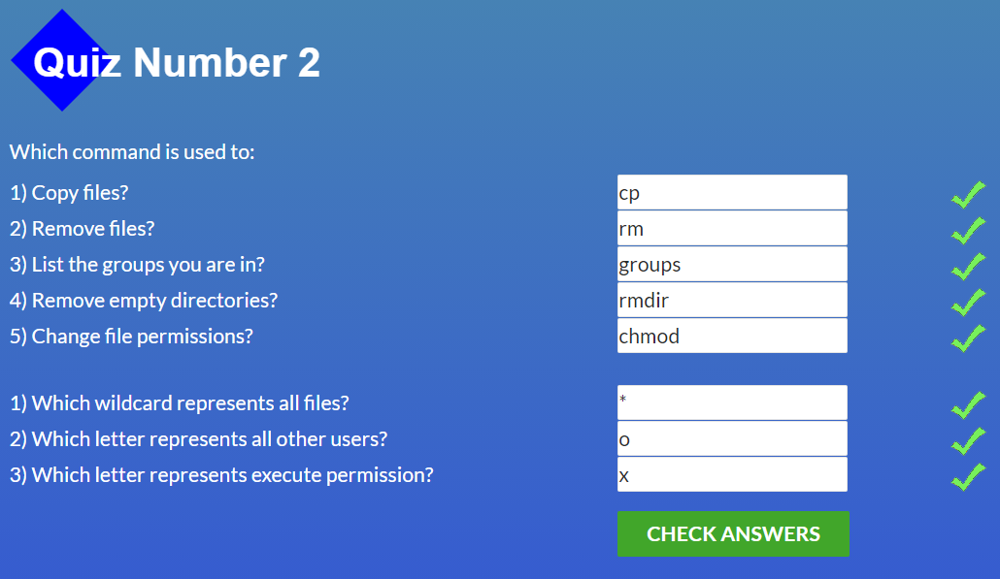
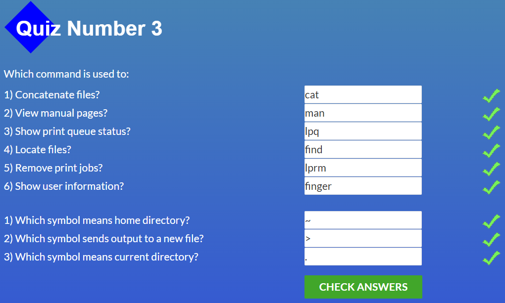
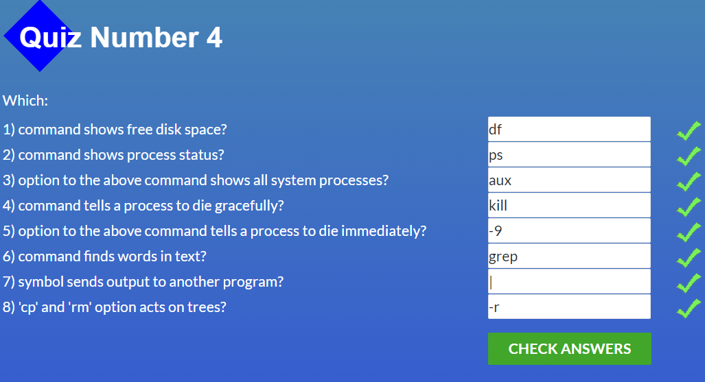

## Lesson 0: Git basics

I had some experience working with GitHub before, but that knowledge was so superficial that I could only perform pull and push requests, check the status of the repository, move the changes to the staging index and perform some basic stuff :) 
After completing this course I understand how this all functions under the hood, how to properly work with branches, perform merges and maintain nice and clean commit history.  

## Lesson 1: Linux CLI and Networking

In this lesson I've refreshed and broden my knowledge about HTTP protocol structure and also learned some new bash commands, such sa grep, | option and some others that were completely new to me. 

git